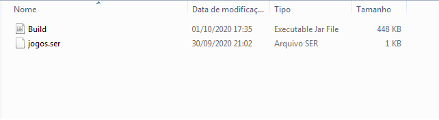

# Questão Prática (Registro de Jogos de Basquete)

<h3>Executar dando click duplo em "Build.jar" no diretório "./build/" do projeto</h3>

<h3>Na tela principal clicar em "Jogos>Tabela de Jogos"</h3>

<h3>Para adicionar um jogo informar um número e o placar e clicar no botão "Adicionar"</h3>
<h3>Para remover informar o número do jogo e clicar no botão "Remover"</h3>

<h3>A tabela contém as informações referente aos jogos como descrito nos requisítos mínimos</h3>